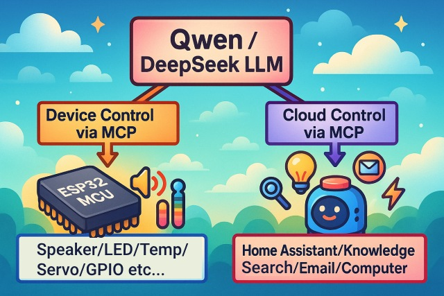
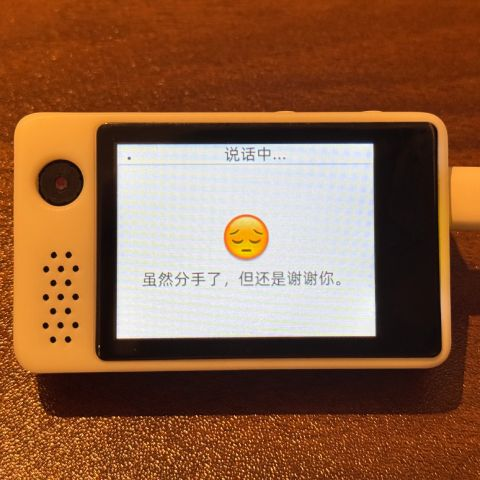
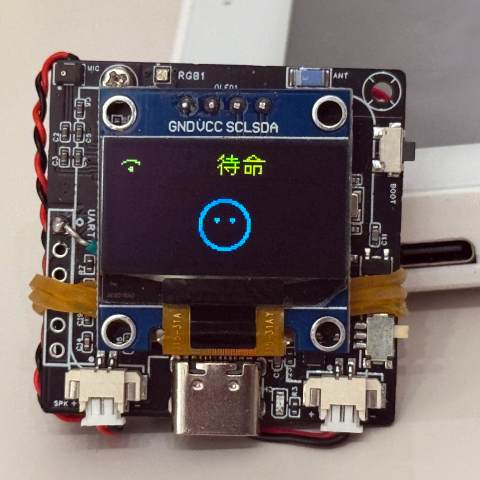
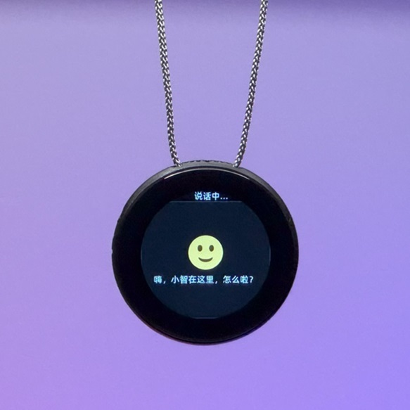

# An MCP-based Chatbot

（中文 | [Tiếng Việt](README.md) | [日本語](README_ja.md)）

## 介紹

👉 [人類：給 AI 裝攝影機 vs AI：當場發現主人三天沒洗頭【bilibili】](https://www.bilibili.com/video/BV1bpjgzKEhd/)

👉 [手工打造你的 AI 女友，新手入門教學【bilibili】](https://www.bilibili.com/video/BV1XnmFYLEJN/)

小智 AI 聊天機器人作為一個語音互動入口，利用 Qwen / DeepSeek 等大模型的 AI 能力，透過 MCP 協定實現多端控制。

### 版本說明

目前 v2 版本與 v1 版本分區表不相容，所以無法從 v1 版本透過 OTA 升級到 v2 版本。分區表說明請參見 [partitions/v2/README.md](partitions/v2/README.md)。

使用 v1 版本的所有硬體，可以透過手動燒錄韌體來升級到 v2 版本。

v1 的穩定版本為 1.9.2，可以透過 `git checkout v1` 來切換到 v1 版本，該分支會持續維護到 2026 年 2 月。

### 已實現功能

- Wi-Fi / ML307 Cat.1 4G
- 離線語音喚醒 [ESP-SR](https://github.com/espressif/esp-sr)
- 支援兩種通訊協定（[Websocket](docs/websocket_zh.md) 或 MQTT+UDP）
- 採用 OPUS 音訊編解碼
- 基於串流 ASR + LLM + TTS 架構的語音互動
- 聲紋辨識，識別當前說話人的身份 [3D Speaker](https://github.com/modelscope/3D-Speaker)
- OLED / LCD 顯示螢幕，支援表情顯示
- 電量顯示與電源管理
- 支援多語言（中文、英文、日文）
- 支援 ESP32-C3、ESP32-S3、ESP32-P4 晶片平台
- 透過裝置端 MCP 實現裝置控制（音量、燈光、馬達、GPIO 等）
- 透過雲端 MCP 擴展大模型能力（智慧家居控制、PC 桌面操作、知識搜尋、電子郵件收發等）
- 自訂喚醒詞、字型、表情與聊天背景，支援網頁端線上修改 ([自訂Assets生成器](https://github.com/78/xiaozhi-assets-generator))

## 硬體

### 麵包板手工製作實踐

詳見飛書文件教學：

👉 [《小智 AI 聊天機器人百科全書》](https://ccnphfhqs21z.feishu.cn/wiki/F5krwD16viZoF0kKkvDcrZNYnhb?from=from_copylink)

麵包板效果圖如下：

### 支援 70 多個開源硬體（僅展示部分）

- <a href="https://oshwhub.com/li-chuang-kai-fa-ban/li-chuang-shi-zhan-pai-esp32-s3-kai-fa-ban" target="_blank" title="立創·實戰派 ESP32-S3 開發板">立創·實戰派 ESP32-S3 開發板</a>
- <a href="https://github.com/espressif/esp-box" target="_blank" title="樂鑫 ESP32-S3-BOX3">樂鑫 ESP32-S3-BOX3</a>
- <a href="https://docs.m5stack.com/zh_CN/core/CoreS3" target="_blank" title="M5Stack CoreS3">M5Stack CoreS3</a>
- <a href="https://docs.m5stack.com/en/atom/Atomic%20Echo%20Base" target="_blank" title="AtomS3R + Echo Base">M5Stack AtomS3R + Echo Base</a>
- <a href="https://gf.bilibili.com/item/detail/1108782064" target="_blank" title="神奇按鈕 2.4">神奇按鈕 2.4</a>
- <a href="https://www.waveshare.net/shop/ESP32-S3-Touch-AMOLED-1.8.htm" target="_blank" title="微雪電子 ESP32-S3-Touch-AMOLED-1.8">微雪電子 ESP32-S3-Touch-AMOLED-1.8</a>
- <a href="https://github.com/Xinyuan-LilyGO/T-Circle-S3" target="_blank" title="LILYGO T-Circle-S3">LILYGO T-Circle-S3</a>
- <a href="https://oshwhub.com/tenclass01/xmini_c3" target="_blank" title="蝦哥 Mini C3">蝦哥 Mini C3</a>
- <a href="https://oshwhub.com/movecall/cuican-ai-pendant-lights-up-y" target="_blank" title="Movecall CuiCan ESP32S3">璀璨·AI 吊墜</a>
- <a href="https://github.com/WMnologo/xingzhi-ai" target="_blank" title="無名科技Nologo-星智-1.54">無名科技 Nologo-星智-1.54TFT</a>
- <a href="https://www.seeedstudio.com/SenseCAP-Watcher-W1-A-p-5979.html" target="_blank" title="SenseCAP Watcher">SenseCAP Watcher</a>
- <a href="https://www.bilibili.com/video/BV1BHJtz6E2S/" target="_blank" title="ESP-HI 超低成本機器狗">ESP-HI 超低成本機器狗</a>

  
  
  
  
  
  
  
  
  
  
  
  

## 軟體

### 韌體燒錄

新手第一次操作建議先不要建立開發環境，直接使用免開發環境燒錄的韌體。

韌體預設接入 [xiaozhi.me](https://xiaozhi.me) 官方伺服器，個人使用者註冊帳號可以免費使用 Qwen 即時模型。

👉 [新手燒錄韌體教學](https://ccnphfhqs21z.feishu.cn/wiki/Zpz4wXBtdimBrLk25WdcXzxcnNS)

### 開發環境

- Cursor 或 VSCode
- 安裝 ESP-IDF 外掛，選擇 SDK 版本 5.4 或以上
- Linux 比 Windows 更好，編譯速度快，也免去驅動問題的困擾
- 本專案使用 Google C++ 程式碼風格，提交程式碼時請確保符合規範

### 開發者文件

- [自訂開發板指南](docs/custom-board_zh.md) - 學習如何為小智 AI 建立自訂開發板
- [MCP 協定物聯網控制用法說明](docs/mcp-usage_zh.md) - 瞭解如何透過 MCP 協定控制物聯網裝置
- [MCP 協定互動流程](docs/mcp-protocol_zh.md) - 裝置端 MCP 協定的實現方式
- [MQTT + UDP 混合通訊協定文件](docs/mqtt-udp_zh.md)
- [一份詳細的 WebSocket 通訊協定文件](docs/websocket_zh.md)

## 大模型設定

如果你已經擁有一個小智 AI 聊天機器人裝置，並且已接入官方伺服器，可以登入 [xiaozhi.me](https://xiaozhi.me) 控制台進行設定。

👉 [後台操作影片教學（舊版介面）](https://www.bilibili.com/video/BV1jUCUY2EKM/)

## 相關開源專案

在個人電腦上部署伺服器，可以參考以下第三方開源的專案：

- [xinnan-tech/xiaozhi-esp32-server](https://github.com/xinnan-tech/xiaozhi-esp32-server) Python 伺服器
- [joey-zhou/xiaozhi-esp32-server-java](https://github.com/joey-zhou/xiaozhi-esp32-server-java) Java 伺服器
- [AnimeAIChat/xiaozhi-server-go](https://github.com/AnimeAIChat/xiaozhi-server-go) Golang 伺服器
- [hackers365/xiaozhi-esp32-server-golang](https://github.com/hackers365/xiaozhi-esp32-server-golang) Golang 伺服器

使用小智通訊協定的第三方客戶端專案：

- [huangjunsen0406/py-xiaozhi](https://github.com/huangjunsen0406/py-xiaozhi) Python 客戶端
- [TOM88812/xiaozhi-android-client](https://github.com/TOM88812/xiaozhi-android-client) Android 客戶端
- [100askTeam/xiaozhi-linux](http://github.com/100askTeam/xiaozhi-linux) 百問科技提供的 Linux 客戶端
- [78/xiaozhi-sf32](https://github.com/78/xiaozhi-sf32) 思澈科技的藍牙晶片韌體
- [QuecPython/solution-xiaozhiAI](https://github.com/QuecPython/solution-xiaozhiAI) 移遠提供的 QuecPython 韌體

## 關於專案

這是一個由蝦哥開源的 ESP32 專案，以 MIT 授權條款發布，允許任何人免費使用、修改或用於商業用途。

我們希望透過這個專案，能夠幫助大家瞭解 AI 硬體開發，將當下飛速發展的大語言模型應用到實際的硬體裝置中。

如果你有任何想法或建議，請隨時提出 Issues 或加入 [Discord](https://discord.gg/C759fGMBcZ) 或 QQ 群：1011329060

## Star History

<a href="https://star-history.com/#78/xiaozhi-esp32&Date">
 <picture>
   <source media="(prefers-color-scheme: dark)" srcset="https://api.star-history.com/svg?repos=78/xiaozhi-esp32&type=Date&theme=dark" />
   <source media="(prefers-color-scheme: light)" srcset="https://api.star-history.com/svg?repos=78/xiaozhi-esp32&type=Date" />
   
 </picture>
</a>
